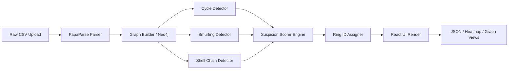

<div align="center">
  
  <h1>💰 ThreatVision</h1>
  <p><strong>Graph-based money muling and financial fraud detection engine</strong></p>
  <p>Track Financial Crime • Detect Fraud Rings • Visualize Threat Architectures</p>

  [](https://reactjs.org/)
  [](https://nodejs.org/)
  [](https://neo4j.com/)
  [](https://tailwindcss.com/)
  <br />
  <strong><a href="https://threat-vision-five.vercel.app">Live Demo</a></strong>
</div>

<br />

## 📖 Overview

**ThreatVision** is a next-generation financial forensics engine designed to detect and visualize complex money muling networks, fraud rings, and suspicious transaction patterns. By analyzing transactional data using graph-theory algorithms, ThreatVision accurately tracks circular fund routing, smurfing structures, and shell account chains.

---

## ✨ Key Features

- 🕸️ **Interactive Graph Visualization:** Leverage Cytoscape to explore complex financial networks, zoom into specific nodes, and visually track how money flows between entities.
- 🕒 **Temporal Heatmap:** A day/hour activity grid that highlights the exact windows when suspicious transactions cluster, allowing analysts to spot coordinated attacks.
- ⭕ **Ring Overlap Detection:** Special visualizations and metrics focusing on "bridge" accounts that span across multiple fraud rings, acting as super-connectors.
- 🤖 **Risk Explanation Panel:** Plain-English, AI-like narrative explanations breaking down exactly *why* a specific account was flagged, easing the investigation process.
- 📄 **JSON Export:** Download comprehensive, machine-readable fraud reports detailing flagged accounts and calculated risk scores.

---

## ⚙️ System Architecture

ThreatVision utilizes a decoupled graph-analysis pipeline to ingest raw transactions, map them relationally, and run intensive detection algorithms:



---

## 🔬 Fraud Detection Algorithms

ThreadVision employs three specialized algorithmic methods to catch money laundering structures:

### 1. Cycle Detection (Circular Fund Routing)
- **Mechanism:** Iterative Depth-First Search (DFS) with a strict depth limit (to avoid stack overflow).
- **Target:** Detects cycles of exactly length 3, 4, and 5.
- **Optimization:** Utilizes canonical deduplication via lexicographic rotation.
- **Complexity:** Time: `O(V × E × d)` (where d=5); Space: `O(V + E)`.

### 2. Smurfing Detection (Fan-in / Fan-out)
- **Mechanism:** Two-pointer sliding window over timestamp-sorted transactions.
- **Target:** Detects large numbers of micro-transactions flowing into or out of a hub.
- **Parameters:** 72-hour sliding window, triggering at ≥10 unique counterparty accounts. Applies a high-velocity bonus for >5 transactions in <6 hours.
- **Complexity:** Time: `O(E log E)` (sort) + `O(E)` (window scan); Space: `O(E)`.

### 3. Shell Chain Detection
- **Mechanism:** Breadth-First Search (BFS) originating from suspected shell nodes.
- **Target:** Identifies intermediate "pass-through" accounts (txCount 2–3) used to distance originators from beneficiaries.
- **Parameters:** Requires a minimum of 3-hop linear chains.
- **Complexity:** Time: `O(V + E)`; Space: `O(V)`.

---

## 🧮 Suspicion Scoring Methodology

Accounts start at a baseline of 0 and accumulate risk points based on graph topology participation:

| Detection Pattern | Base Score |
|-------------------|------------|
| `cycle_length_3` | +40 points |
| `cycle_length_4` | +35 points |
| `cycle_length_5` | +30 points |
| `fan_in` / `fan_out` | +25 points |
| `shell_chain` | +20 points |
| `high_velocity` | +15 points |

**Additional Multipliers & Behaviors:**
- **Multi-Ring Member:** +10 points (for acting as a bridge).
- **Round Amounts (>$1000):** +5 points.
- **24-hour Cluster:** +8 points.
- **Score Cap:** Absolute maximum score is clamped to `100`.

### 🛡️ False Positive Handling
Legitimate high-volume accounts (e.g., payroll, merchants) are filtered out via heuristic thresholds:
- `txCount > 200` AND `counterparties > 80` → **Excluded** (Assumed Merchant).
- Consistent weekly amounts to `50+ receivers` → **Excluded** (Assumed Payroll).
- `txCount > 500` → **Excluded** (Assumed System/Exchange Account).

---

## 🛠️ Technology Stack

| Component | Technology | Description |
|-----------|------------|-------------|
| **Frontend UI** | React 18, Vite | UI component framework and fast bundler. |
| **Styling** | Tailwind CSS, Framer Motion | Utility-first styling and smooth UI animations. |
| **Graph Logic** | Cytoscape.js | High-performance graph canvas rendering. |
| **Data Parsing** | PapaParse | In-browser, blazing fast CSV ingest. |
| **Backend & Graph DB** | Node.js, Neo4j | Server-side Cypher query execution for heavy network math. |

---

## 🚀 Installation & Setup

1. **Clone the repository:**
   ```bash
   git clone https://github.com/Jagadish-s-naik/ThreatVision.git
   cd ThreatVision
   ```

2. **Install Frontend Dependencies:**
   ```bash
   cd money-mule-detector
   npm install
   ```

3. **Install Backend Dependencies:**
   ```bash
   cd ../server
   npm install
   ```

4. **Run the Application:**
   Start both the frontend and backend servers.
   ```bash
   # Terminal 1 (Frontend)
   cd money-mule-detector
   npm run dev
   
   # Terminal 2 (Backend)
   cd server
   npm run start
   ```

---

## 📊 Usage Guide

1. **Upload Dataset:** Open the app and upload a transaction CSV file. 
   *(Required Columns: `transaction_id`, `sender_id`, `receiver_id`, `amount`, `timestamp`)*
2. **Analysis Execution:** The engine automatically processes up to 10K transactions in under 30 seconds.
3. **Graph View:** Interact with the generated financial network. Click on red (suspicious) nodes to view their exact risk breakdown.
4. **Timeline Heatmap:** Switch to the Heatmap tab to visualize exact time periods where fraud clusters operate.
5. **Ring Overlap Analysis:** Find highly dangerous bridge accounts connecting multiple crime rings.
6. **Export Data:** Navigate to the JSON Export tab to download a standardized REST-ready fraud report.

**Data Requirements:** 
- Timestamps must be strictly formatted as `YYYY-MM-DD HH:MM:SS`.

---

## ⚠️ Known Limitations

- Fraud cycles exceeding 5 hops are ignored (per system latency / spec limits).
- Shell detection strict-requires a minimum of 2 transactions per shell node.
- To maintain browser performance, graphs containing >2000 active nodes will automatically downgrade to a flat layout instead of a force-directed layout.

---

## 👨‍💻 Developer

**Jagadish S Naik** 
<br/>
*Ignited dev *
